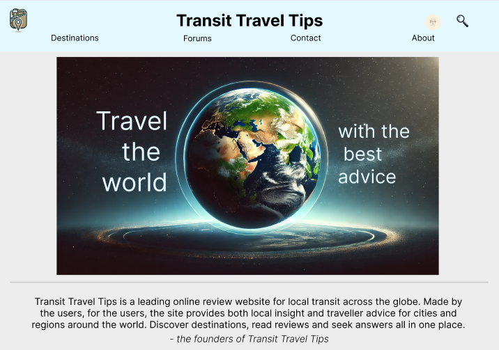
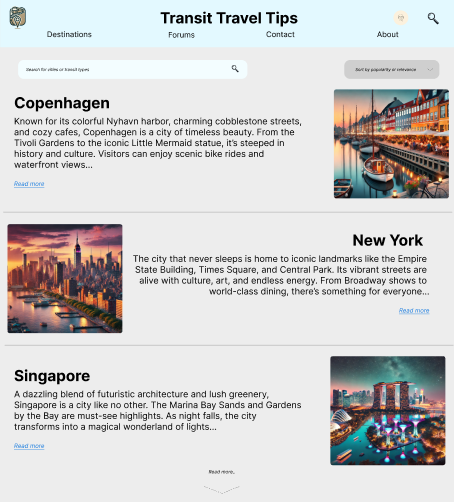
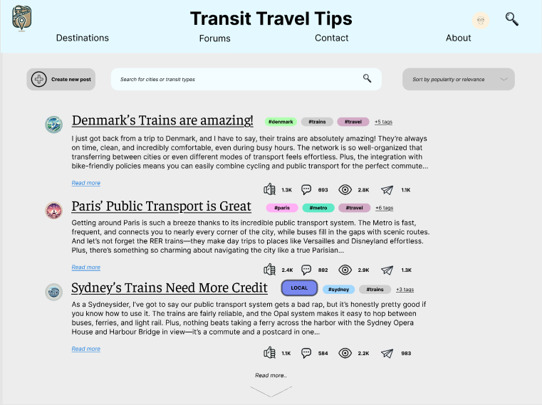
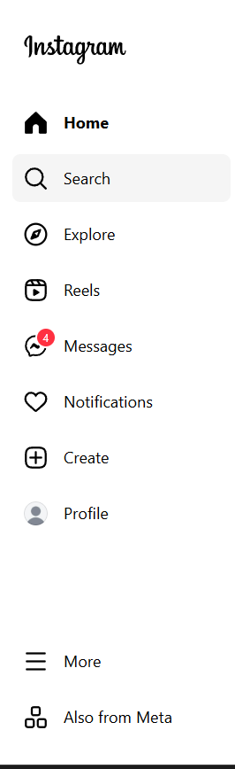
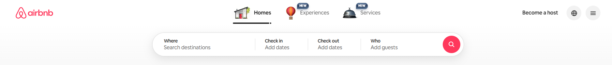
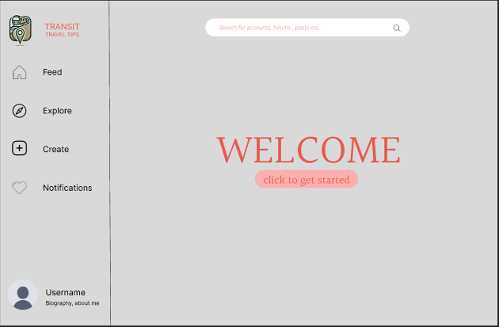
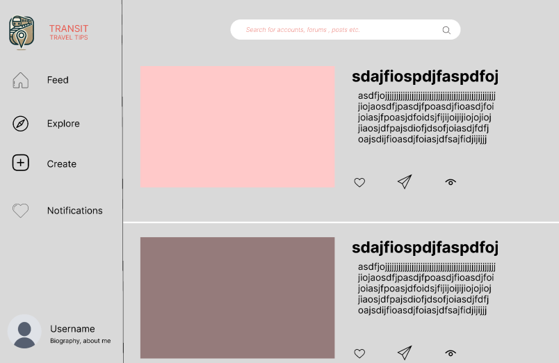
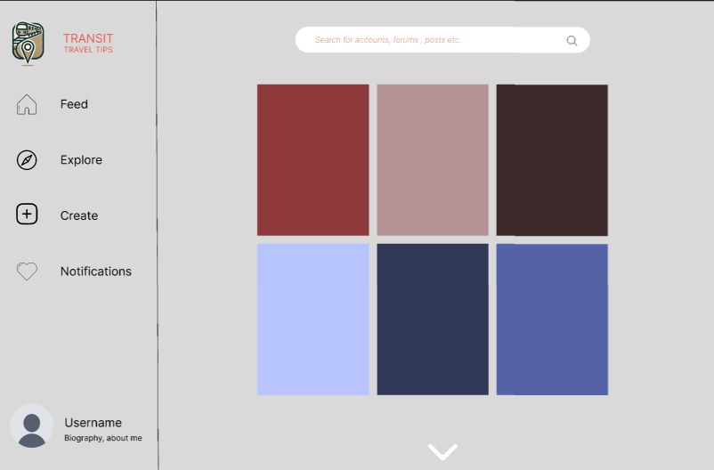
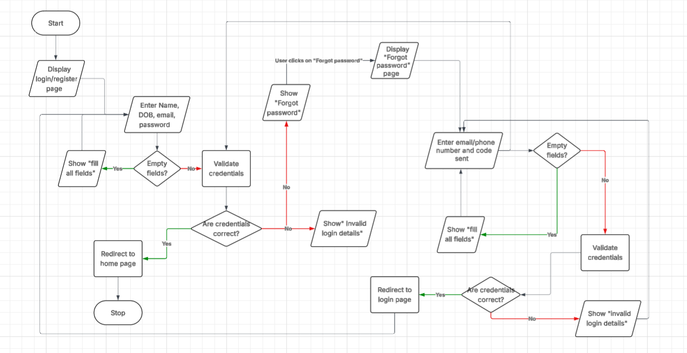

# transit travel tips

## website overview
Transit Travel Tips is a user-driven website designed to help travellers share and discover advice about experiences from travelling through various destinations. The platform will feature a clean, easy-to-use interface with categorized forums, search tools, and user profiles. It aims to create a welcoming and informative community hub with multilingual support and secure, scalable infrastructure. The design will focus on clarity, accessibility, and smooth performance across devices.

| **functional requirements** | **non-functional requirements** |
| ----------- | ----------- |
| user registration and login | secure data storage using encryption |
| forum and post management | friendly UI |
| categorisation of posts| scalable backend for handling growth |6
| user account management |
| analytics and Feedback| 

### first wireframe

for my first wireframe, colour palattes and typography were not mainly focused on. the header placement and design layout were experimented with.

### theme
the overall theme of the website is social media apps such as instagram, especially the sidebar containing the home, messages, notifications and explore buttons. however, instead of the search bar being on the side, there will be a global search bar at the top of the website, similar to the one on airbnb.

### colour palette
the colour scheme of the website will be "minimal yet warm", having the colours:
- #EAE7DC light shade of yellow
- #D8C3A5 shade of cream
- #8E8D8A light grey
- #E98074 light red
- #E85A4F red

### typography
a clean, simple and neutral images, similar to helvetica and nimbus sans will be considered for the website.

### second wireframe

### data flow
the majority of user data flow will occur through the sidebar, where each button will direct the user to another page, allowing users to sign in, create posts, explore posts and places.

### login page flowchart

### test cases
**test tase id: tc01**

ttle: verify that user can login with valid credentials

precodintions:
- user has an account in website database
- user knows their credentials

test steps:
1. user clicks login button
2. enters valid credentials in all fields
3. click the "login" button

expected results:
- user is redirected to homepage

**priority: high**

**test case id: tco2**

title: user enters the wrong password
- user has an account in website database
- user knows their email/username, but not their password

test steps:
1. user clicks login button
2. user enters valid username and invalid password
3. click the "login" button

expected results:
- message appears on screen that their password is incorrect
- password section has been cleared
- login fails

### queries
1. Query all posts that have id 5, regardless of user
SELECT * FROM posts WHERE id = 5;

2. Query all users created on a specific date
SELECT * FROM extension WHERE user_created LIKE '2025-01-15%';

3. Query all users with username character length of 10
SELECT * FROM extension WHERE LENGTH(username) = 10;

4. Query all posts created by users with even numbered ids that contain "travel" in the title
SELECT * FROM posts WHERE (user_id % 2) = 0 AND title LIKE "%travel%";

5. Query all posts with odd numbered ids that have more than 5 likes
SELECT posts.*, COUNT(likes.id) as like_count 
FROM posts 
LEFT JOIN likes ON posts.id = likes.post_id 
WHERE (posts.id % 2) = 1 
GROUP BY posts.id 
HAVING like_count > 5;

6. Query all comments created by users with even username lengths that mention "Africa" in the comment
SELECT comments.*, extension.username 
FROM comments 
JOIN extension ON comments.username = extension.username 
WHERE (LENGTH(extension.username) % 2) = 0 AND comments.comment_text LIKE "%Africa%";

### development log

date | work copmleted / issues faced
-----|----
20/8 | created own tables in sqlite databse
22/8 | ran into errors with git and python
25/8 | worked through css and html styling tutorial
26/8 | ran into many errors while trying to load my local host.
27/8 | got localhost to work, started working on the home page html
28/8 | styled my homepage by adding a background image

the development log was not further updated as commits were being regularly uploaded, however, upon submitting the task, i discovered an error which made the commits not sync to my github. i did not realise until i made my final adjustments, which lead to all files being synced under one commit.

### lighthouse report

september 18 2025
- performance: 100
- accessibility: 91
- best practices: 100
- seo: 89

these high results were due to the fact that my website had limited information, just the core structure of webpages.

11/10/25

login page:
- performance: 94
- accessibility: 91
- best practices: 96
- seo: 90

feed page:
- performance: 99
- accessibility: 97
- best practices: 93
- seo: 91

## overview

this task has allowed me 